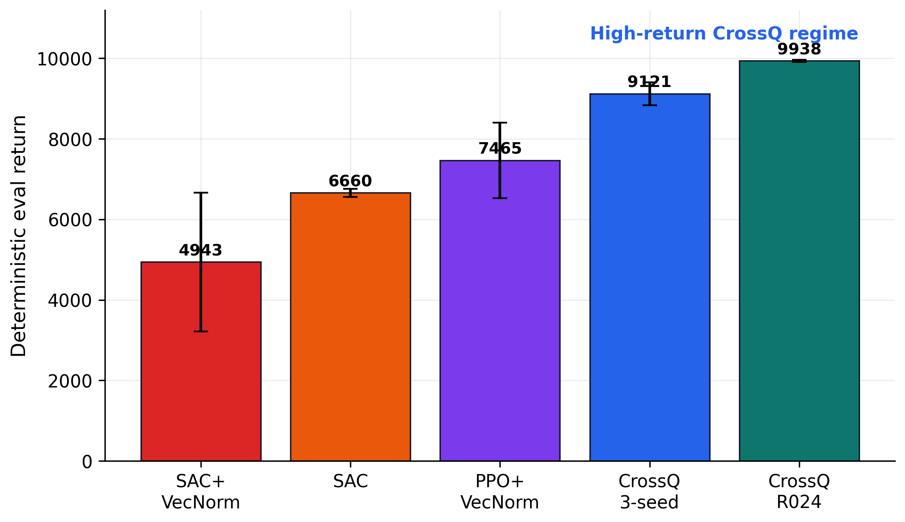
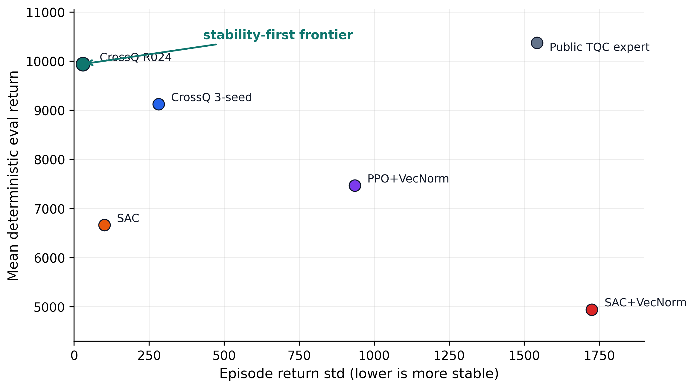
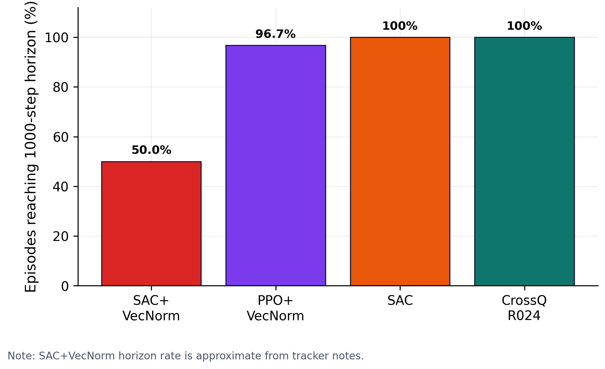

# Humanoid-v5 CrossQ Benchmark

This repository provides training and evaluation scripts for reproducible 5M-step experiments on Gymnasium `Humanoid-v5`.

The focus is not to introduce a new reinforcement-learning algorithm. Instead, this repository compares PPO, SAC, SAC+VecNormalize, and CrossQ baselines under a shared evaluation protocol. The main observation is that CrossQ is a strong and relatively stable baseline in this setup.

## Demo

## Demo

The following video shows the R024 CrossQ stability-focused run.

https://github.com/LUOseu/Humanoid-v5-ZeroFall-SOTA-level/raw/main/R024_demo.mp4

If the video does not render in the README preview, open
[R024_demo.mp4](R024_demo.mp4) directly.

## Highlights

- CrossQ 3-seed baseline: `9121 ± 282` return at 5M environment steps.
- CrossQ R024: approximately `9938 ± 30` over 10 deterministic evaluation episodes.
- R024 completed 10/10 evaluation episodes to the 1000-step horizon.
- PPO/SAC comparison: under this repository's 5M-step setup, CrossQ obtains higher mean evaluation return than the local PPO and SAC baselines.
- Claim boundary: this repository does not claim overall `Humanoid-v5` state of the art. Public TQC expert policies report a higher mean return, while the R024 run here shows lower episode-return variance under this repository's evaluation protocol.

## Results

| System | Steps | Seeds | Evaluation return | Notes |
|---|---:|---:|---:|---|
| CrossQ baseline | 5M | 3 | `9121 ± 282` | Best reproduced baseline in this repository |
| CrossQ R024 | 5M | 1 | `9938 ± 30` | Stability-focused run; 10/10 episodes reached 1000 steps |
| PPO + VecNormalize | 5M | 3 | `7465 ± 935` | One seed had a collapse episode |
| SAC | 5M | 3 | `6660 ± 101` | Stable but lower return |
| SAC + VecNormalize | 5M | 3 | `4943 ± 1725` | High variance and frequent early collapses |

The R024 result is a single-seed result evaluated over 10 deterministic episodes. It should not be interpreted as a statistically complete stability study.

## Figures

Return comparison across local baselines:



Stability-return tradeoff, including the public TQC expert reference:



Full-horizon completion rate during evaluation:



## Repository Layout

| Path | Purpose |
|---|---|
| `train_crossq.py` | Main CrossQ training script for 5M-step benchmark runs |
| `train_crossq_v2.py` | Configurable CrossQ script for hyperparameter exploration |
| `evaluate_crossq.py` | Deterministic CrossQ evaluation on raw `Humanoid-v5` return |
| `train.py` / `train_ppo_v2.py` | PPO baselines with `VecNormalize` |
| `train_sac.py` | SAC baseline without observation/reward normalization |
| `train_sac_vecnorm.py` | SAC + `VecNormalize` diagnostic run |
| `evaluate.py`, `evaluate_sac.py`, `eval_all_models.py` | Evaluation helpers |
| `R024_demo.mp4` | Short demo video for the stability-focused CrossQ run |

## Installation

Python 3.10 is recommended.

```bash
python -m venv .venv
source .venv/bin/activate
pip install --upgrade pip
pip install -r requirements.txt
```

For headless GPU machines, set MuJoCo rendering before recording videos:

```bash
export MUJOCO_GL=egl
```

## Training

CrossQ baseline:

```bash
python train_crossq.py \
  --seed 2027 \
  --total-timesteps 5000000 \
  --n-envs 4 \
  --save-dir runs/crossq_humanoid_v5_s2027 \
  --device cuda
```

Repeat with seeds `2028` and `2029` for the 3-seed baseline.

Configurable CrossQ run:

```bash
python train_crossq_v2.py \
  --seed 2027 \
  --total-timesteps 5000000 \
  --n-envs 4 \
